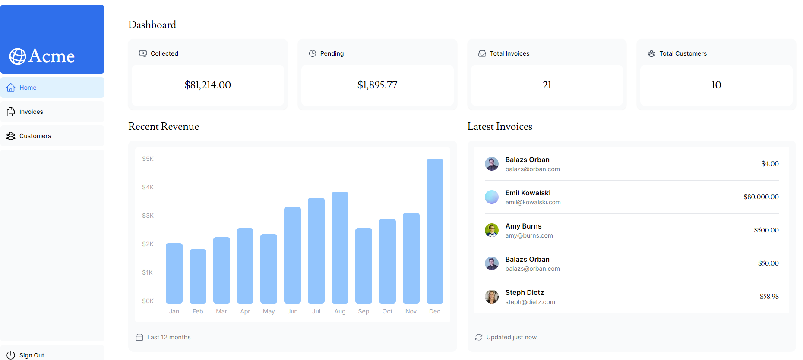

## Aplicação feita no curso de introdução fornecido no site do Next

1. **Instale as dependências**: 
    - `npm install`

2. **Adicione .env**:
    - Faça uma cópia do arquivo '.env.template' e altere o nome para '.env'.
    - Preencha as informações de conexão com o banco.
    - Adicione uma secret no campo AUTH_SECRET

2. **Inicie a aplicação**:
    - `npm run dev`
#
### Pagina da dashboard

#

Para mais informações veja o [curso](https://nextjs.org/learn) no site do Next.js.